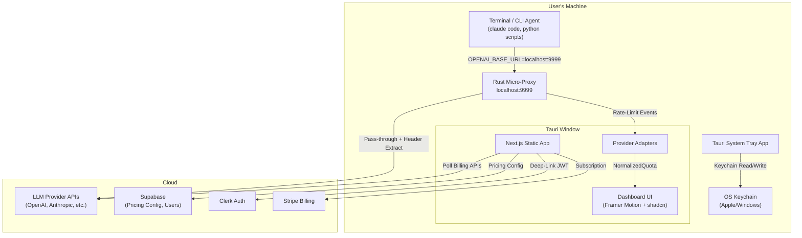

# Ceil ── 📐 Never hit a 429 error again.

> A minimalist, privacy-first native desktop dashboard tracking token capacity, rolling quotas, and spend for developers. Built with Next.js, Tauri, and Supabase.

## Product Summary

**Ceil** is a centralized menubar/system-tray application that tracks token usage, costs, and real-time rate limits across all top LLM providers (OpenAI, Anthropic, Gemini, Groq, Mistral, Cohere). It acts as a lightweight, zero-latency local proxy that extracts real-time rate limit headers. Monetized at **$9/mo**, targeting indie developers spending $100–$1,000+/mo on AI APIs. Core philosophy: **BYOK**, **zero data retention**, **visually stunning**.

---

## User Review Required

> [!IMPORTANT]
> **Tech Stack Confirmation**: The PRD specifies a comprehensive stack. Please confirm you're comfortable with all of these:
> - **Tauri** (Rust) for the desktop shell — requires Rust toolchain
> - **Next.js 15** (Static Export) for the UI layer
> - **Tailwind CSS v4** + **shadcn/ui** for styling
> - **Supabase** for cloud backend (pricing config, user accounts)
> - **Clerk** for authentication (with deep-link JWT flow)
> - **Stripe** for $9/mo billing

> [!WARNING]
> **Tauri Complexity**: Building a local micro-proxy in Rust that intercepts HTTP traffic is a significant engineering effort. The PRD's Phase 2 (Weeks 3–4) timeline may be ambitious. Do you want to:
> 1. Build the **full Tauri + Rust proxy** from Phase 1
> 2. Start with a **web-only dashboard** (polling billing APIs) and add Tauri/proxy later
> 3. Follow the PRD's phased approach exactly as written

> [!IMPORTANT]
> **Provider Priority**: The PRD mentions OpenAI, Anthropic, Gemini, Groq, Mistral, and Cohere. Which providers should we implement first for the MVP?

---

## Open Questions

1. **Tailwind v4 vs v3?** — The PRD doesn't specify. v4 is latest but has breaking changes from v3. shadcn/ui officially supports both. Which do you prefer?
2. **Tremor vs Recharts?** — Both are listed in the PRD. Tremor has a more opinionated dark-mode design but is heavier. Recharts is lighter and more customizable. Preference?
3. **MVP Scope** — Should Phase 1 MVP include the Tauri desktop wrapper, or start as a web-only dashboard first?
4. **Mock Data for Dev?** — Should we build with mock LLM provider data initially (no real API keys required to develop the UI)?
5. **Supabase Local Dev?** — Use Supabase local Docker instance during development, or mock the backend like the previous project?
6. **GitHub Repository** — The updated plan lists the repo as `https://github.com/yourusername/ceil.git`. Could you provide the exact GitHub repository URL you want me to push to?

---

## Proposed Changes

### Architecture Overview



---

### Component 1: Next.js Frontend

The core UI layer running as a static HTML export inside the Tauri window.

#### [NEW] [package.json](file:///C:/0_Antigravity%20Template/Codelab_Antigravity/5_AI%20API%20Cost%20&%20Quota%20Dashboard/app_build/package.json)
- Next.js 15, React 19, TypeScript, Tailwind CSS v4, shadcn/ui, Framer Motion, Sonner, Recharts/Tremor
- Scripts: `dev`, `build`, `export`, `tauri dev`, `tauri build`

#### [NEW] [next.config.ts](file:///C:/0_Antigravity%20Template/Codelab_Antigravity/5_AI%20API%20Cost%20&%20Quota%20Dashboard/app_build/next.config.ts)
- `output: 'export'` for static HTML generation (Tauri compatibility)
- Image optimization disabled (static export constraint)

#### [NEW] [tailwind.config.ts](file:///C:/0_Antigravity%20Template/Codelab_Antigravity/5_AI%20API%20Cost%20&%20Quota%20Dashboard/app_build/tailwind.config.ts)
- Dark-mode-first color palette (Linear/Vercel inspired)
- Custom design tokens for the dashboard aesthetic

#### [NEW] [app/layout.tsx](file:///C:/0_Antigravity%20Template/Codelab_Antigravity/5_AI%20API%20Cost%20&%20Quota%20Dashboard/app_build/app/layout.tsx)
- Root layout with dark mode, Inter/Geist font, Sonner toast provider

#### [NEW] [app/page.tsx](file:///C:/0_Antigravity%20Template/Codelab_Antigravity/5_AI%20API%20Cost%20&%20Quota%20Dashboard/app_build/app/page.tsx)
- Main dashboard view: quota bars, cost chart, countdown timers, provider cards

---

### Component 2: Provider Adapter Layer

The Adapter Design Pattern implementation for normalizing disparate LLM provider data.

#### [NEW] [lib/providers/types.ts](file:///C:/0_Antigravity%20Template/Codelab_Antigravity/5_AI%20API%20Cost%20&%20Quota%20Dashboard/app_build/lib/providers/types.ts)
- `NormalizedQuota` interface: `provider`, `model`, `inputTokensRemaining`, `outputTokensRemaining`, `requestsRemaining`, `resetTimestamp`, `costPerInputToken`, `costPerOutputToken`
- `ProviderAdapter` interface: `parseHeaders()`, `fetchUsage()`, `fetchBilling()`

#### [NEW] [lib/providers/openai.ts](file:///C:/0_Antigravity%20Template/Codelab_Antigravity/5_AI%20API%20Cost%20&%20Quota%20Dashboard/app_build/lib/providers/openai.ts)
- OpenAI adapter: parses `x-ratelimit-*` headers, fetches `/dashboard/billing/usage`

#### [NEW] [lib/providers/anthropic.ts](file:///C:/0_Antigravity%20Template/Codelab_Antigravity/5_AI%20API%20Cost%20&%20Quota%20Dashboard/app_build/lib/providers/anthropic.ts)
- Anthropic adapter: parses `anthropic-ratelimit-*` headers

#### [NEW] [lib/providers/gemini.ts](file:///C:/0_Antigravity%20Template/Codelab_Antigravity/5_AI%20API%20Cost%20&%20Quota%20Dashboard/app_build/lib/providers/gemini.ts)
- Google Gemini adapter: parses Google-specific rate-limit responses

#### [NEW] [lib/providers/groq.ts](file:///C:/0_Antigravity%20Template/Codelab_Antigravity/5_AI%20API%20Cost%20&%20Quota%20Dashboard/app_build/lib/providers/groq.ts)
- Groq adapter

#### [NEW] [lib/providers/factory.ts](file:///C:/0_Antigravity%20Template/Codelab_Antigravity/5_AI%20API%20Cost%20&%20Quota%20Dashboard/app_build/lib/providers/factory.ts)
- Adapter factory: maps provider name → adapter instance

---

### Component 3: Dashboard UI Components

Premium, dark-mode-first UI components using shadcn/ui + Framer Motion.

#### [NEW] [components/quota-bar.tsx](file:///C:/0_Antigravity%20Template/Codelab_Antigravity/5_AI%20API%20Cost%20&%20Quota%20Dashboard/app_build/components/quota-bar.tsx)
- Animated progress bar showing remaining quota (tokens/requests) per provider
- Color-coded: green → yellow → red as quota depletes
- Smooth Framer Motion transitions

#### [NEW] [components/countdown-timer.tsx](file:///C:/0_Antigravity%20Template/Codelab_Antigravity/5_AI%20API%20Cost%20&%20Quota%20Dashboard/app_build/components/countdown-timer.tsx)
- Real-time countdown until rate limit resets
- Derived from `resetTimestamp` in `NormalizedQuota`

#### [NEW] [components/cost-chart.tsx](file:///C:/0_Antigravity%20Template/Codelab_Antigravity/5_AI%20API%20Cost%20&%20Quota%20Dashboard/app_build/components/cost-chart.tsx)
- Rolling cost chart (daily/weekly/monthly) using Tremor/Recharts
- Per-provider cost breakdown

#### [NEW] [components/provider-card.tsx](file:///C:/0_Antigravity%20Template/Codelab_Antigravity/5_AI%20API%20Cost%20&%20Quota%20Dashboard/app_build/components/provider-card.tsx)
- Compact card for each configured provider showing: name, status, quota bars, cost

#### [NEW] [components/velocity-alert.tsx](file:///C:/0_Antigravity%20Template/Codelab_Antigravity/5_AI%20API%20Cost%20&%20Quota%20Dashboard/app_build/components/velocity-alert.tsx)
- Sonner-powered toast notifications for velocity spikes

#### [NEW] [components/settings-panel.tsx](file:///C:/0_Antigravity%20Template/Codelab_Antigravity/5_AI%20API%20Cost%20&%20Quota%20Dashboard/app_build/components/settings-panel.tsx)
- API key management UI (add/remove/edit keys — stored in OS Keychain via Tauri)
- Provider toggle switches
- Alert threshold configuration
- Budget limits per provider

---

### Component 4: Tauri Desktop Shell

The Rust-based desktop wrapper providing system tray, keychain access, and local proxy.

#### [NEW] [src-tauri/Cargo.toml](file:///C:/0_Antigravity%20Template/Codelab_Antigravity/5_AI%20API%20Cost%20&%20Quota%20Dashboard/app_build/src-tauri/Cargo.toml)
- Tauri framework, keyring crate, hyper (HTTP proxy), tokio (async runtime)

#### [NEW] [src-tauri/tauri.conf.json](file:///C:/0_Antigravity%20Template/Codelab_Antigravity/5_AI%20API%20Cost%20&%20Quota%20Dashboard/app_build/src-tauri/tauri.conf.json)
- System tray configuration, window settings (menubar-style), deep-link protocol (`apidash://`)

#### [NEW] [src-tauri/src/main.rs](file:///C:/0_Antigravity%20Template/Codelab_Antigravity/5_AI%20API%20Cost%20&%20Quota%20Dashboard/app_build/src-tauri/src/main.rs)
- Tauri app initialization, system tray setup, event loop

#### [NEW] [src-tauri/src/keychain.rs](file:///C:/0_Antigravity%20Template/Codelab_Antigravity/5_AI%20API%20Cost%20&%20Quota%20Dashboard/app_build/src-tauri/src/keychain.rs)
- OS Keychain CRUD operations exposed as Tauri commands

#### [NEW] [src-tauri/src/proxy.rs](file:///C:/0_Antigravity%20Template/Codelab_Antigravity/5_AI%20API%20Cost%20&%20Quota%20Dashboard/app_build/src-tauri/src/proxy.rs)
- Local HTTP proxy server on `localhost:9999`
- Intercepts requests, extracts rate-limit headers, emits events to webview
- Full pass-through of request/response body (zero data retention)

#### [NEW] [src-tauri/src/deeplink.rs](file:///C:/0_Antigravity%20Template/Codelab_Antigravity/5_AI%20API%20Cost%20&%20Quota%20Dashboard/app_build/src-tauri/src/deeplink.rs)
- `apidash://auth?token=JWT` handler for Clerk authentication flow

---

### Component 5: Cloud Backend (Supabase)

#### [NEW] [lib/supabase/client.ts](file:///C:/0_Antigravity%20Template/Codelab_Antigravity/5_AI%20API%20Cost%20&%20Quota%20Dashboard/app_build/lib/supabase/client.ts)
- Supabase client initialization

#### [NEW] [lib/pricing.ts](file:///C:/0_Antigravity%20Template/Codelab_Antigravity/5_AI%20API%20Cost%20&%20Quota%20Dashboard/app_build/lib/pricing.ts)
- Dynamic pricing config fetcher — polls `pricing.json` from Supabase Storage every 24h
- Local cache with TTL

#### [NEW] Database Schema (Supabase SQL)
```sql
-- Users & subscriptions managed by Clerk + Stripe
-- Local usage history (optional cloud sync)
CREATE TABLE usage_snapshots (
  id UUID PRIMARY KEY DEFAULT gen_random_uuid(),
  user_id TEXT NOT NULL,
  provider TEXT NOT NULL,
  model TEXT,
  input_tokens_used BIGINT DEFAULT 0,
  output_tokens_used BIGINT DEFAULT 0,
  cost_usd NUMERIC(10,6) DEFAULT 0,
  recorded_at TIMESTAMPTZ DEFAULT now()
);

CREATE TABLE alert_configs (
  id UUID PRIMARY KEY DEFAULT gen_random_uuid(),
  user_id TEXT NOT NULL,
  provider TEXT NOT NULL,
  velocity_threshold_pct NUMERIC(5,2) DEFAULT 300.00,
  budget_limit_usd NUMERIC(10,2),
  enabled BOOLEAN DEFAULT true
);
```

---

## Phased Build Plan

### Phase 1: The Local MVP (Weeks 1–2)
1. Initialize Next.js 15 + Tailwind CSS v4 + shadcn/ui scaffold
2. Build core UI components: `quota-bar`, `countdown-timer`, `cost-chart`, `provider-card`
3. Implement `NormalizedQuota` interface and provider adapter factory
4. Build OpenAI + Anthropic + Gemini adapters (polling billing endpoints)
5. Create mock data layer for development without real API keys
6. Build settings panel for API key input (local storage mock, keychain later)

### Phase 2: Universal Header Parsing & The Hook (Weeks 3–4)
1. Initialize Tauri project scaffold (`src-tauri/`)
2. Implement keychain.rs for OS-native key storage
3. Build the local micro-proxy (proxy.rs) with header extraction
4. Implement real-time rate-limit countdown UI
5. Add Groq + Mistral adapters
6. Connect proxy events to the Next.js UI via Tauri event bridge

### Phase 3: Premium Polish & Desktop Wrapper (Weeks 5–6)
1. Wrap Next.js in Tauri system tray/menubar configuration
2. Refine Framer Motion animations for progress bars and transitions
3. Implement velocity alert system (Sonner toasts + OS notifications)
4. Integrate Clerk deep-link authentication
5. Integrate Stripe for $9/mo subscription
6. Set up dynamic pricing config polling from Supabase
7. Build "What-If" cost optimization insights (weekly intelligence)

---

## Verification Plan

### Automated Tests
- `npm run build` — Verify Next.js static export compiles successfully
- `cargo check` in `src-tauri/` — Verify Rust code compiles
- `npm run lint` — TypeScript and ESLint checks
- Unit tests for each provider adapter (header parsing accuracy)
- Unit tests for pricing calculation engine

### Manual Verification
- Launch `npm run dev` and verify the dashboard renders with mock data
- Launch `npm run tauri dev` and verify the desktop window + system tray
- Test API key storage/retrieval via OS Keychain
- Test local proxy with a curl command through `localhost:9999`
- Test Clerk deep-link flow end-to-end
- Verify velocity alert notifications fire correctly
